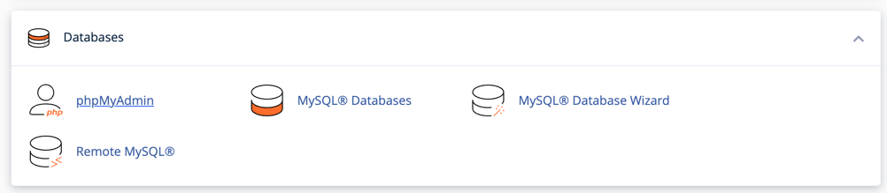
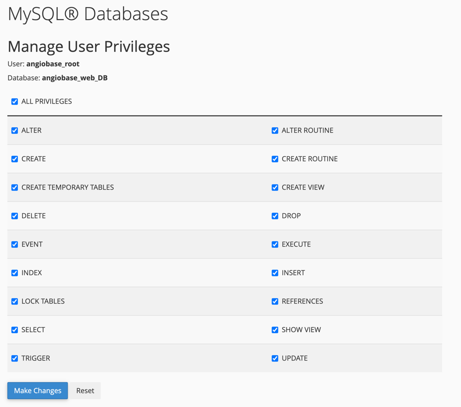

AngioBase
***
cPannel setup
1. Start by logging into the cPannel application. It should look something like the image below.

2. Navigate down to the "Setup Python App" under "Software". This will take you to the setup page

3. Set the variables as shown below. 

4. Environment variables can also be set and setup scripts initialized

5. SSH into the server, source the venv with the command found above the "STOP APP" command in step 3. 
6. run the command in the terminal with the venv sourced.
```angular2html
pip3 install -r requirements.txt
```
7. Run the command to make sure the database is setup correctly 
```angular2html
python3 manage.py migrate
```
8. Restart the python application in cPannel.


***
For testing.
This code is setup to be tested with docker. Enter the following two commands to start:
1. docker compose build
2. docker compose up

Sometimes the migration script fails to connect to the db. in this case just go to docker desktop
and restart the migration container. Then restart the angiobase container.

***
Notes for setting-up the codebase for deployment.

In the settings.py file change the DEBUG variable too False to disable static file serving. If left on True,
the website will serve all project files directly. This is a security issue.

Because the static file server is disabled, a new server must be used. For this we use the whitenoise python library.
The calls for whitenoise are added to the settings.py file in the INSTALLED_APPS and MIDDLEWARE sections. 

The Codebase is currently setup to interface with a mySQL server in a docker container. If using the docker compose
function, this DB starts and configures itself automatically. If using a different SQL server, make sure to change the
DATABASES variable accordingly.

***
To see how to setup a database for local use, see the init/01-users.sql file. To set MySQL up in cPannel, follow the
instructions below. 
1. navigate to the Databases section of the cPanel tools page and click the "MySQL Databases" link.

2. Create or modify a DB to spec. For angiobase, the DB should be "angiobase_web_DB"

3. create a user and assign a password. Once the user is created, add them to the DB.

4. When the user is added to the DB, a new page will appear to select the user permissions. Assign permissions as needed.
